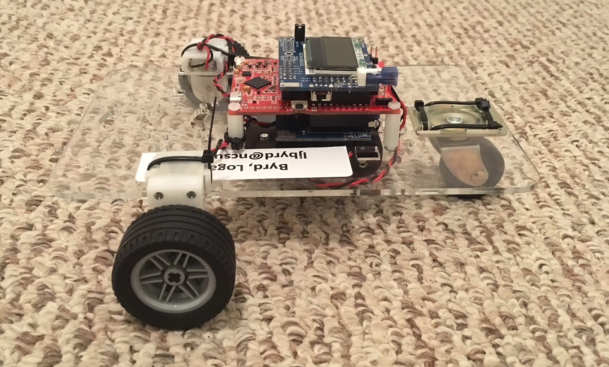

# Embedded IOT Controlled Car

Source code for autonomous IoT-controlled car project for college embedded systems course.

Real-time embedded operating system written in C for MSP430 microcontroller. The car was designed to autonomously follow the path of a black line. The car could also be controlled over TCP/IP for remote control access.